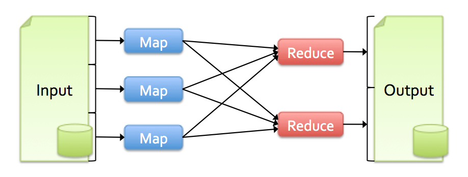
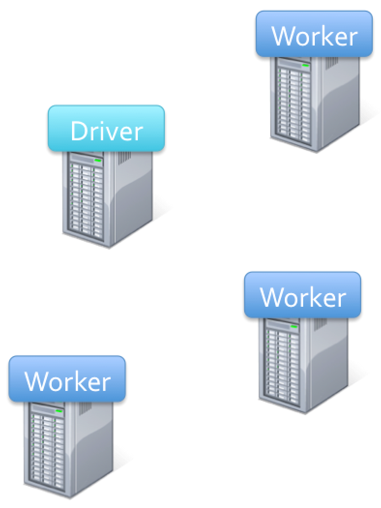

Data aggregation and summarization at scale
========================================================
author: Hector Corrada Bravo
date: CMSC498T Spring 2015

For today
========================================================

1. Project questions
2. Log transform
3. Parallelism, Map-Reduce and Spark

Transforming Data
=========================================

Dealing with skewed data


```r
flights %>% ggplot(aes(dep_delay)) + geom_histogram(binwidth=30)
```

 

Transforming Data
=========================================

Dealing with skewed data


```r
library(magrittr)
flights %>% 
  sample_n(100) %>% 
  magrittr::extract2("dep_delay") %T>% 
  qqnorm %>% 
  qqline
```

 

Skewed Data
=========================================

Considerations:
- Long-tail variables hard to incorporate into some modeling procedures, especially in the presence of other variables that are not long-tailed
- Variables may capture *multiplicative* processes: very common in physical and biochemical processes

Skewed Data
=========================================

When a multiplicative process makes sense, then a logarithmic transform is appropriate to handle this.

- If values are all positive: apply `log2` transform
- If some values are negative, two options
  - Started Log: shift all values so they are positive, apply `log2`
  - Signed Log: $sign(x) \times log2(abs(x))$, but set all $|x| < 1$ to $1$.
  
Skewed Data
==============================

Started log:


```r
flights %>%
  mutate(log_delay = log2(dep_delay - min(dep_delay, na.rm=TRUE) + 1)) %>%
  sample_n(100) %>%
  magrittr::extract2("log_delay") %T>%
  qqnorm() %>%
  qqline()
```

 

Skewed Data
==============================

Signed log:


```r
flights %>%
  mutate(log_delay = ifelse(abs(dep_delay) < 1, 0, sign(dep_delay) * log2(abs(dep_delay)))) %>%
  sample_n(100) %>%
  magrittr::extract2("log_delay") %T>%
  qqnorm() %>%
  qqline()
```

 

Manipulation and summarization at scale
=========================================

For very large datasets, many of the operations we've seen for aggregation and summarization can be parallelized:

- partition observations and perform transformation on each partition as a parallel process
- partition variables and perform transformation on each variable as a parallel process
- for summarization (`group_by` and `summarize`), partition observations based on `group_by` expression, perform `summarize` on each partition.

Manipulation and summarization at scale
=========================================

Efficiency of implementation of this type of parallelism depends on underlying architecture.

- Shared memory vs. Shared storage vs. Shared nothing
- For massive datasets, last is usually preferred
  - Fault tolerance most important consideration

Map-reduce
=========================================

Map-Reduce is an implementation idea for a shared nothing architecture. 
Main features:
  - Distributed storage
  - Data proximity (perform operaations on data that is physically close)
  - Fault tolerance
  
Map-reduce
=========================================

Basic computation paradigm is based on two operations:
  - reduce: perform operation on subset of observations in parallel
  - map: decide which parallel process (node) should operate on each observation
  


Map-reduce
=========================================

Basic computation paradigm is based on two operations:
  - reduce: perform operation on subset of observations in parallel
  - map: decide which parallel process (node) should operate on each observation
  
`group_by` clause corresponds to `map`  
`summarize` function corresponds to `reduce`

Map-reduce
=========================================

 

- Most efficient when computations organized in an acyclic graph.
  - Move data from stable storage to computing process
  - Move result to stable storage

Map-reduce
=========================================

 

- Runtime benefits:
  - resource allocation
  - failure recovery
- Existing implementations do not support interactive use

Spark
=======

Recent system, based on general map-reduce framework, for ultra-fast data analysis

Features:
  - efficient support for interactive analysis 
    - (the kind we do in R)
  - designed to support iterative workflows 
    - (many Machine Learning algorithms need this)
  
Spark
======

- Basic data abstraction is the RDD (resilient distributed datasets).
- Applications can keep working sets of data in memory
  - iterative algorithms
  - interactive workflows

Spark
======

Basic data abstraction is the RDD (resilient distributed datasets).  
- Inmutable, *partitioned* collections of objects
- Created by parallel *transformations* on data in stable storage
  - (map, filter, group_by, join, ...)
- Can be *cached* for efficient reuse
- Actions on RDDs (count, reduce, collect, save, ...)

Example (using SparkR)
=======================

Count occurences of phrases in abstracts (based on regular expression searches) over a large scientific corpus.

***



Example (using SparkR)
=========================


```r
library(SparkR)
library(stringr)

# initialize spark framework
sc <- sparkR.init("local")

# base RDD
lines = textFile(sc, "hdfs://...")

# transformed RDD
abstracts = filterRDD(lines, function(line) str_detect(unlist(line), "ABSTRACT"))
```

Example (using SparkR)
=========================


```r
# mapped RDD
abstract_text = map(abstracts, function(line) str_split(unlist(line), " ")[[1]])

# cached RDD
cached_text = cache(abstract_text)
```

Example (using SparkR)
=========================
left: 60%


```r
library(magrittr)

# RDD action
cached_text %>% 
  filterRDD(function(line) str_detect(unlist(line), "foo")) %>% 
  count
```

***


Example (using SparkR)
=========================
left: 60%


```r
# new RDD action re-uses cache
cached_text %>% 
  filterRDD(function(line) str_detect(unlist(line), "bar")) %>% 
  count
```

***


Fault Tolerance
=========================

RDDs maintain *lineage*, so partitions can be reconstructed upon failure.


```r
textFile(sc, "hdfs://...") %>%
  filterRDD(function(line) str_detect(unlist(line), "ABSTRACT:")) %>%
  map(function(line) str_split(unlist(line), " ")[[2]])
```


The pieces
=========================

**Transformations**: Define new RDDs

[https://spark.apache.org/docs/latest/programming-guide.html#transformations](https://spark.apache.org/docs/latest/programming-guide.html#transformations)

**Actions**: Return results to driver program

[https://spark.apache.org/docs/latest/programming-guide.html#actions](https://spark.apache.org/docs/latest/programming-guide.html#actions)

Final Notes
============

- Designed first for Java, interactive shell based on Scala 
- Strong support in Python, initial support with SparkR
- Spark programming guide: [https://spark.apache.org/docs/latest/programming-guide.html](https://spark.apache.org/docs/latest/programming-guide.html)
- More info on SparkR: [http://amplab-extras.github.io/SparkR-pkg/](http://amplab-extras.github.io/SparkR-pkg/)
