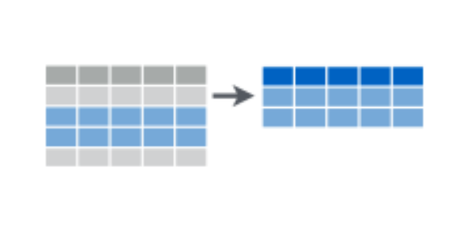

Data Wrangling
========================================================
author: Wikum Dinalankara and Hector Corrada Bravo
date: CMSC498T Spring 2015

Catching up with Baltimore Analysis
========================================================

**Reminder**: You can check current status of Baltimore analysis
here: [http://htmlpreview.github.io/?https://github.com/hcorrada/IntroDataSciBaltimore/blob/master/baltimore.html](http://htmlpreview.github.io/?https://github.com/hcorrada/IntroDataSciBaltimore/blob/master/baltimore.html)

Some thoughts
- Make sure your analysis is reproducible: i.e., your classmates must be able to add to it and have it run. I always update 
the `html` file before merging your analysis. I will not accept pull requests that are not reproducible.
- If you use new data in the analysis add it to the repository using `git add`

Tidy Data
========================================================

1. Each variable forms a column
2. Each observation forms a row
3. Each type of observational unit forms a table

For Today
=====================================

- Manipulating tidy data
- Cleaning data
- Transforming data

Manipulation
======================================

The `dplyr` package: one of the most beautiful tools created for data analysis

- Clearly defines and efficiently implements most common data manipulation operations (verbs)
- Built around tidy data principles
- Uniform treatment of multiple backends (in memory files, partially loaded files, databases)
- Pipes can be used to elegantly chain multiple manipulation operations

Subsetting Observations
========================================

Selecting or filtering rows (observations) of a tidy
data table by condition or sampling.

 


```r
# include only flights on United Airlines
flights %>% filter(carrier == "UA")
```

Subsetting Variables
========================================
Selecting or filtering columns (variables) of a tidy
data table by condition 

 


```r
# select only month carrier and origin variables
flights %>% select(month,carrier,origin)
```

Note: On tidy data tables, subsetting variables at random 
is not commonly done

Creating New Variables
=========================================

Use existing variables to create new observations
- Transformation of single variable
- Functions of multiple variables

 

Creating New Variables
=========================================

 


```r
# add new variable with total delay
flights %>% mutate(delay=dep_delay + arr_delay)
```

Summarizing Data
==========================================

Summarize multiple observations (rows) for a variable (column) into 
a single value

 


```r
# compute mean total delay across all flights
flights %>% 
  mutate(delay = dep_delay + arr_delay) %>%
  summarize(mean(delay, na.rm=TRUE))
```

Grouping Data
=========================================

Group observations (rows) with same value of one or
more variables (columns). Usually used along
`summarize` or `mutate`.

 


```r
# compute mean total delay per carrier
flights %>%
  mutate(delay = dep_delay + arr_delay) %>%
  group_by(carrier) %>%
  summarize(delay=mean(delay, na.rm=TRUE))
```


Missing Data
========================================

When to remove? When to *impute*?

- missing at random vs. missing systematically

Transforming Data
=========================================

Normalization and rescaling

Transforming Data
=========================================

Discretizing continuous values

Transforming Data
=========================================

Treating discrete values as continuous

Transforming Data
=========================================

Dealing with skewed data


